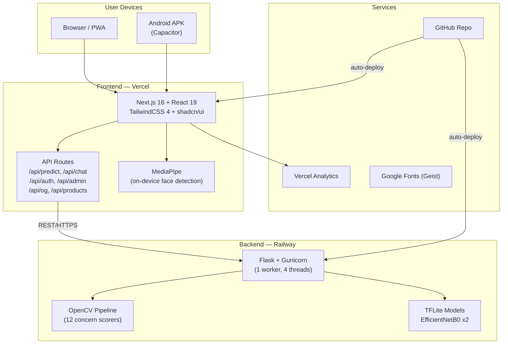
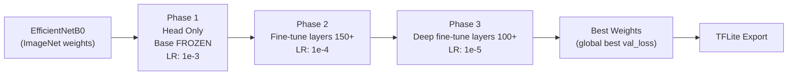
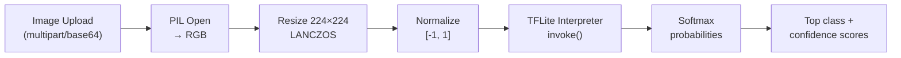
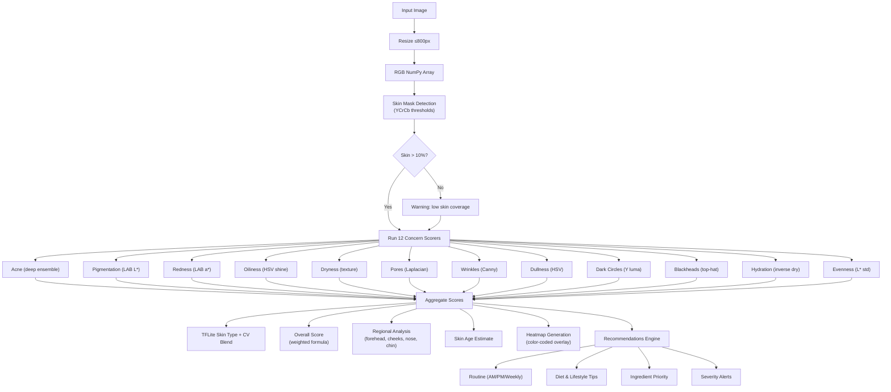
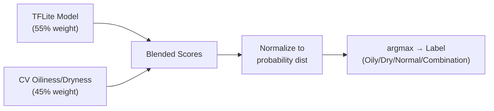
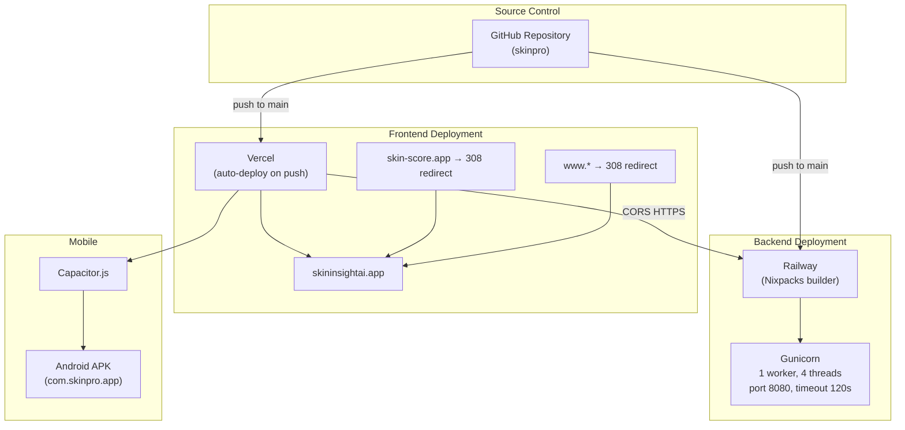
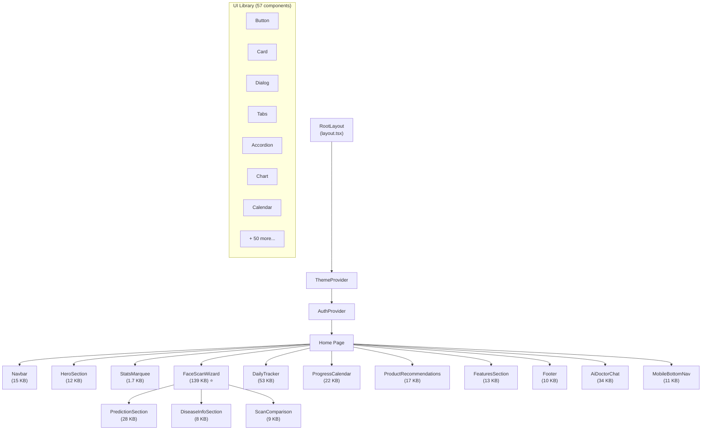
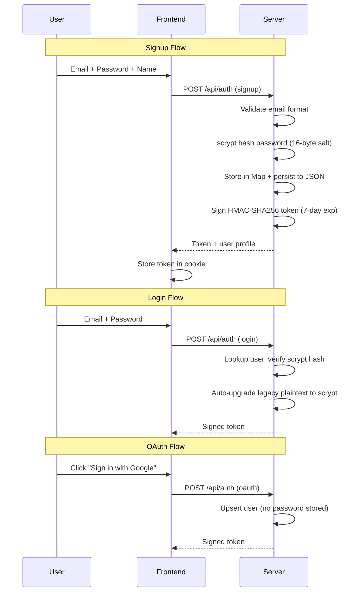
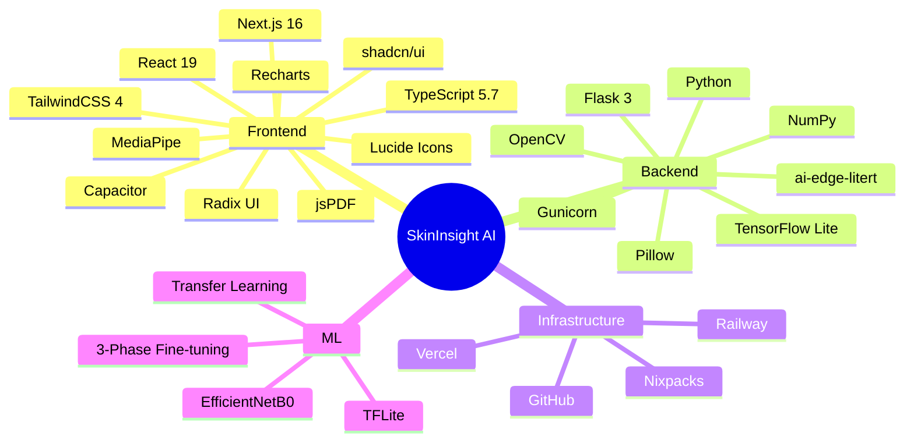
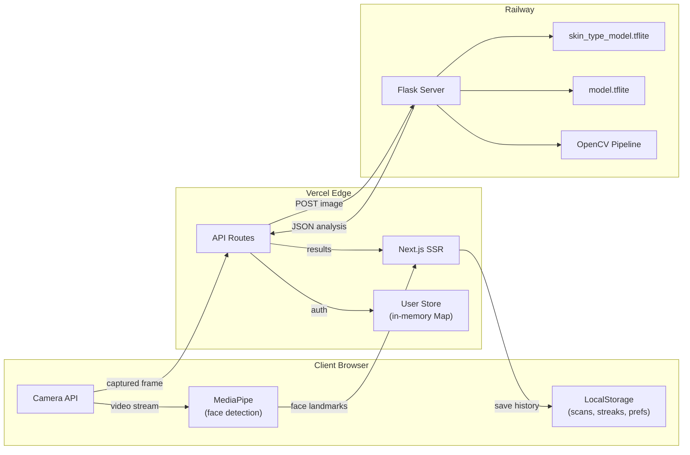

# SkinInsight AI — Comprehensive Project Report

> **Project**: SkinInsight AI (SkinPro)  
> **URL**: https://skininsightai.app  
> **Backend**: https://skinprov2-production.up.railway.app  
> **Date**: May 2026  
> **Server Version**: 8.3.0-acne-deep-ensemble

---

## 1. Executive Summary

SkinInsight AI is a **full-stack AI-powered skin analysis web application** that allows users to scan their face using a camera or upload a photo and receive an instant, detailed skin health report. The system analyzes **12 skin concerns** (acne, pigmentation, redness, oiliness, dryness, pores, wrinkles, dullness, dark circles, blackheads, hydration, evenness), determines **skin type** using a hybrid ML+CV approach, and generates personalized skincare routines, diet tips, lifestyle recommendations, and ingredient priorities.

### Key Highlights
- **Free tier** available — no signup required for basic scans
- **On-device face detection** via MediaPipe (privacy-first)
- **Multi-angle ensemble analysis** (front + left + right) for higher accuracy
- **PDF report export** with professional formatting
- **AI Doctor Chat** for interactive skin questions
- **PWA + Android APK** support via Capacitor
- **SEO-optimized** with structured data, sitemap, blog, and OpenGraph

---

## 2. System Architecture


### Architecture Overview



| Layer | Technology | Hosting |
|-------|-----------|---------|
| **Frontend** | Next.js 16, React 19, TailwindCSS 4, shadcn/ui (57 components) | Vercel |
| **Backend** | Flask, Gunicorn, OpenCV, TFLite, NumPy, Pillow | Railway |
| **ML Models** | EfficientNetB0 (TFLite, 2 × ~16.7 MB) | Bundled with backend |
| **Mobile** | Capacitor.js wrapping web app | Android APK |
| **Auth** | HMAC-SHA256 signed tokens, scrypt password hashing | Server-side |
| **Storage** | LocalStorage (client), JSON file (server, ephemeral) | In-process |

---

## 3. Project Directory Structure

```
skinpro/
├── .env.production              # ML_SERVER_URL
├── vercel.json                  # Vercel service config
└── project1/                    # Main project root
    ├── deploy.sh                # Deployment guide script
    ├── DEPLOY_NOW.ps1           # PowerShell deploy helper
    ├── requirements.txt         # Python deps (Flask, OpenCV, TFLite)
    ├── railway.toml             # Railway build config (Nixpacks)
    ├── start.sh                 # Gunicorn start command
    ├── .railwayignore           # Railway upload exclusions
    ├── ml/                      # (root-level ML placeholder)
    │   └── .env.example
    └── project1/                # Next.js frontend app
        ├── package.json         # Node deps (79 packages)
        ├── next.config.mjs      # Redirects, headers, camera policy
        ├── capacitor.config.ts  # Android app config
        ├── tsconfig.json
        ├── app/                 # Next.js App Router pages
        │   ├── layout.tsx       # Root layout + SEO + JSON-LD
        │   ├── page.tsx         # Home page (11 sections)
        │   ├── globals.css      # 545-line design system
        │   ├── sitemap.ts       # Dynamic sitemap
        │   ├── robots.ts        # Robots.txt
        │   ├── manifest.ts      # PWA manifest
        │   ├── api/             # 9 API route groups
        │   │   ├── predict/     # Skin analysis proxy
        │   │   ├── analyze-multi/ # Multi-angle ensemble
        │   │   ├── chat/        # AI doctor chat
        │   │   ├── auth/        # Login/signup/OAuth
        │   │   ├── admin/       # User management
        │   │   ├── billing/     # Plan management
        │   │   ├── products/    # Product recommendations
        │   │   ├── tips/        # Skincare tips
        │   │   └── og/          # OpenGraph image gen
        │   ├── blog/            # SEO blog with posts
        │   ├── pricing/         # Pricing page
        │   ├── how-it-works/    # Tutorial page
        │   ├── login/           # Auth pages
        │   └── signup/
        ├── components/          # 23 custom + 57 UI components
        │   ├── face-scan-wizard.tsx    # 139 KB — core scan feature
        │   ├── daily-tracker.tsx       # 53 KB — routine tracker
        │   ├── ai-doctor-chat.tsx      # 34 KB — AI chat
        │   ├── prediction-section.tsx  # 28 KB — results display
        │   ├── progress-calendar.tsx   # 22 KB — history
        │   ├── product-recommendations.tsx # 17 KB
        │   ├── navbar.tsx, footer.tsx, hero-section.tsx...
        │   └── ui/              # 57 shadcn/ui primitives
        ├── lib/                 # Utilities
        │   ├── pdf-report.ts    # 24 KB — PDF generation
        │   ├── user-store.ts    # User management
        │   ├── auth-token.ts    # HMAC token signing
        │   └── utils.ts
        ├── hooks/               # React hooks
        │   ├── use-mobile.ts
        │   └── use-toast.ts
        ├── ml/                  # ML models + server
        │   ├── server.py        # 2097 lines — Flask ML server
        │   ├── predict.py       # CLI inference tool
        │   ├── train.py         # Disease model training
        │   ├── train_skin_type.py # Skin type model training
        │   ├── model.tflite     # 16.7 MB disease model
        │   ├── skin_type_model.tflite # 16.7 MB skin type model
        │   ├── labels.txt       # healthy, lupus, ringworm, scalp_infections
        │   └── skin_type_labels.txt   # dry, normal, oily
        └── public/              # Static assets (logos, icons)
```

---

## 4. Machine Learning Pipeline


### 4.1 Models

| Model | File | Size | Classes | Dataset |
|-------|------|------|---------|---------|
| **Skin Type** | `skin_type_model.tflite` | 16.7 MB | dry, normal, oily | Oily-Dry-Skin-Types (cleaned) |
| **Disease** | `model.tflite` | 16.7 MB | healthy, lupus, ringworm, scalp_infections | MamData800 |

### 4.2 Training Strategy (3-Phase Progressive Fine-Tuning)



**Training features**: Data augmentation (flip, rotation, zoom, brightness, contrast, saturation, hue), class weight balancing, label smoothing (0.1), EarlyStopping, ReduceLROnPlateau, global best weight tracking across all phases.

### 4.3 Inference Pipeline



### 4.4 Runtime Fallback Chain

```
tflite_runtime → ai_edge_litert → tensorflow.lite → CV-only fallback
```

The server gracefully degrades — if no TFLite runtime is available, it still runs all 12 CV-based concern scorers.

---

## 5. Computer Vision Analysis Pipeline


### 5.1 Analysis Flow



### 5.2 Acne Detection (v8.3 Deep Ensemble)

The acne scorer is the most sophisticated, detecting 4 morphologies:

| Type | Detection Method | Criteria |
|------|-----------------|----------|
| **Papules** | DoG of LAB a* channel | a_excess > 4, a > 140, S > 60 |
| **Pustules** | Bright center in red region | V > 215, S < 70, surrounded by red |
| **Cysts** | Large inflamed dark-red regions | a_excess > 7, a > 148, L < baseline |
| **Bumps** | DoG of L channel (skin-tone agnostic) | L_dog > 6, gradient > 14, L_std > 6 |

Post-processing: Connected component analysis → aspect ratio filter → facial feature exclusion (eyes, lips, nostrils) → position weighting (acne zones) → soft-saturating score curve.

### 5.3 Skin Type Derivation (Hybrid)



### 5.4 Heatmap Legend

| Color | Concern |
|-------|---------|
| 🔴 Red | Acne / inflamed spots |
| 🟣 Purple | Pigmentation / dark spots |
| 🟠 Orange | Redness areas |
| 🟡 Yellow | Oily / shine areas |

---

## 6. Deployment Architecture



### Deployment Configuration

| Config | Value |
|--------|-------|
| **Railway builder** | Nixpacks |
| **Start command** | `bash start.sh` → `gunicorn -w 1 -k gthread --threads 4 -b 0.0.0.0:$PORT --timeout 120 server:app` |
| **ML Server URL** | `https://skinprov2-production.up.railway.app` |
| **Domain redirects** | `skin-score.app`, `www.*`, `project1-beta-pied.vercel.app` → `skininsightai.app` |
| **Camera policy** | `Permissions-Policy: camera=(self)` |
| **Cost** | $0/month (free tier) |

---

## 7. Frontend Component Architecture



### Key Components by Size

| Component | Size | Purpose |
|-----------|------|---------|
| `face-scan-wizard.tsx` | **139 KB** | Core feature: camera, MediaPipe face detection, multi-angle capture, analysis display |
| `daily-tracker.tsx` | **53 KB** | Daily routine checklist, streak tracking, habit logging |
| `ai-doctor-chat.tsx` | **34 KB** | Floating AI doctor chat panel |
| `prediction-section.tsx` | **28 KB** | Analysis results display with scores and charts |
| `pdf-report.ts` | **24 KB** | 3-page PDF report generation with jsPDF |
| `progress-calendar.tsx` | **22 KB** | Scan history and progress visualization |
| `product-recommendations.tsx` | **17 KB** | Curated skincare product suggestions |

---

## 8. API Endpoints

### Backend (Flask — Railway)

| Method | Endpoint | Description |
|--------|----------|-------------|
| `GET` | `/health` | Readiness probe + capability flags |
| `POST` | `/analyze` | Single image skin analysis |
| `POST` | `/predict` | Alias for `/analyze` (backwards compat) |
| `POST` | `/analyze-multi` | Multi-angle ensemble analysis |

### Frontend (Next.js API Routes — Vercel)

| Route | Description |
|-------|-------------|
| `/api/predict` | Proxy to Railway backend |
| `/api/analyze-multi` | Multi-angle analysis proxy |
| `/api/chat` | AI doctor chat |
| `/api/auth` | Login / Signup / OAuth (Google, Apple, GitHub) |
| `/api/admin` | User management (admin only) |
| `/api/billing` | Plan management |
| `/api/products` | Product recommendations |
| `/api/tips` | Skincare tips |
| `/api/og` | Dynamic OpenGraph image generation |

### Analysis Response Schema

```json
{
  "success": true,
  "version": "8.3.0-acne-deep-ensemble",
  "elapsed_ms": 450,
  "validation": { "is_skin_photo": true, "skin_coverage": 0.65 },
  "skin_type": { "label": "Oily", "confidence": 0.82, "source": "model+cv" },
  "skin_age": { "estimate": 24, "band": "youthful" },
  "concerns": {
    "acne": 35.2, "pigmentation": 22.1, "redness": 18.5,
    "oiliness": 52.0, "dryness": 12.3, "pores": 28.7,
    "wrinkles": 8.1, "dullness": 31.4, "dark_circles": 15.0,
    "blackheads": 20.5, "hydration": 72.3, "evenness": 68.9
  },
  "overall_score": 71.2,
  "lesion_count": 4,
  "regions": { "forehead": {...}, "left_cheek": {...}, "right_cheek": {...}, "nose": {...}, "chin": {...} },
  "heatmap": "data:image/jpeg;base64,...",
  "recommendations": [...],
  "routine": { "morning": [...], "evening": [...], "weekly": [...] },
  "diet": [...], "lifestyle": [...],
  "severity_alerts": [...],
  "ingredient_priority": [...]
}
```

---

## 9. Authentication & User Management



### Security Features
- **Password hashing**: scrypt with 16-byte random salt, 64-byte derived key
- **Token signing**: HMAC-SHA256 with `AUTH_SECRET` environment variable
- **Timing-safe comparison**: `crypto.timingSafeEqual` for both password verification and token validation
- **Legacy compatibility**: Auto-upgrades plaintext passwords to scrypt on login
- **OAuth support**: Google, Apple, GitHub — stores `oauth:<random>` as unusable password

---

## 10. Pricing & Plans

| Plan | Price | Scans/Month | Features |
|------|-------|-------------|----------|
| **Free** | ₹0 forever | 5 | Basic AI chat, product recs, 30-day history |
| **Pro** | ₹299/mo | 50 | Unlimited AI chat, routine builder, progress tracking, email reminders |
| **Premium** | ₹799/mo | Unlimited | Multi-angle deep analysis, skin-age tracking, PDF reports, API access |

---

## 11. SEO & Marketing

### Implemented SEO Features
- **Structured Data (JSON-LD)**: Organization, WebSite, WebApplication, FAQPage schemas
- **Dynamic Sitemap**: Static pages + blog posts with priorities and change frequencies
- **Meta Tags**: Title templates, descriptions, OpenGraph, Twitter cards
- **Dynamic OG Images**: `/api/og` endpoint generates social preview images
- **Robots.txt**: Full indexing with GoogleBot optimization
- **Google Verification**: Site verified with Search Console
- **Canonical URLs**: All domain variants redirect to `skininsightai.app`
- **IndexNow**: PowerShell script for instant search engine notification
- **Blog**: Content marketing with multiple SEO-optimized posts
- **PWA Manifest**: Installable web app with icons

### Keywords Targeted
`AI skin analysis`, `free skin test`, `acne detection AI`, `face scan app`, `personalized skincare routine`, `skin type quiz`, `skin health checker`, `dark circle detection`

---

## 12. Design System

### CSS Architecture (545 lines)
- **Color system**: OKLCH color space with light/dark theme tokens
- **Typography**: Geist + Geist Mono (Google Fonts)
- **Animations**: 15+ keyframe animations (blob, fade, slide, pulse, shimmer, sparkle, float, drift)
- **Glass effects**: `glass-card`, `glass-pane`, `glass-strong` with backdrop-filter blur
- **Premium utilities**: `gradient-text`, `gradient-border`, `shadow-glow`, `noise` texture, `aurora-bg`, `mesh-dots`
- **Mobile-first**: Touch-optimized tap targets (min 44px), iOS rubber-band prevention, input zoom prevention

---

## 13. Technology Stack Summary



---

## 14. Data Flow Diagram



---

## 15. Key Metrics & Stats

| Metric | Value |
|--------|-------|
| **Total source files** | ~120+ (excl. node_modules, .venv) |
| **Largest component** | `face-scan-wizard.tsx` (139 KB) |
| **ML server code** | `server.py` (2,097 lines, 104 KB) |
| **UI component library** | 57 shadcn/ui primitives |
| **Custom components** | 23 app-specific components |
| **TFLite models** | 2 × ~16.7 MB |
| **Skin concerns analyzed** | 12 |
| **Facial regions analyzed** | 5 (forehead, left cheek, right cheek, nose, chin) |
| **CSS animations** | 15+ custom keyframes |
| **API endpoints** | 12 (3 backend + 9 frontend) |
| **NPM dependencies** | ~60 packages |
| **Python dependencies** | 7 core packages |

---

## 16. Future Considerations

> [!IMPORTANT]
> The current user store is **in-memory with JSON file persistence** — data resets on cold starts in serverless environments. For production scale, migrate to a database (PostgreSQL, Supabase, MongoDB).

> [!WARNING]
> The disease detection model (`model.tflite`) is trained on only 4 classes from a small dataset (MamData800). The application wisely pivoted to **concern-based CV analysis** rather than disease diagnosis claims.

> [!TIP]
> The multi-angle ensemble analysis significantly improves confidence scores. The agreement metric across angles provides a reliability indicator for users.

---

*Report generated from complete source code analysis of the SkinInsight AI codebase.*
